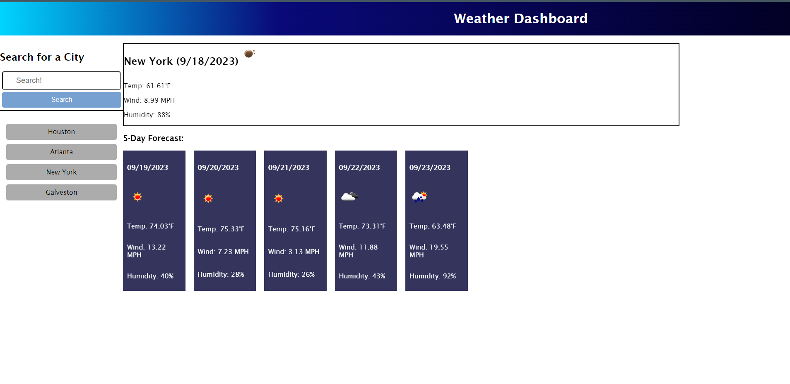

# Challenge 6: Weather Dashboard

## Description

This project is a webpage that is displaying a weather dashboard. It was a project built using a third party api (openWeather), localStorage, data attributes, and other important fundamentals of a website.
The webpage features a static header, dynamic icons and text based on the city that is chosen, a current day weather display, a forecast of the next 5 days, and a history of searched cities.

This project was pretty fair and a little difficult. I think the project really challenged me to put everything I've learned so far into one webpage. I think I am finally getting the hang of local storage and 
DOM traversal.

## Installation

To install the project, clone the repository onto your PC.
Enter the directory that has the cloned repository and open (Double click) the index.html, style.css and script.js files to read the code and access the files.

To access the webpage, click the link below:

https://phipham0.github.io/challenge-6-weather-dashboard/

## Usage

There is a static header at the topic labeled Weather Dashboard. On the left side is a search form where the user can type in the name of a city like "Houston", or "Atlanta." Clicking submit after typing in a city
will display that city's weather for the day and its next 5 days, showing temperature, wind, and humidity. Also, a history of the cities search will display under the search form. This history is stored in the 
web browsers local storage and will stay unless cleared, regardless of refreshes.

## Credits

Credit to the previous class activites. Referencing local storage was a lifesaver.

## License

MIT License

Copyright (c) [year] [fullname]

Permission is hereby granted, free of charge, to any person obtaining a copy
of this software and associated documentation files (the "Software"), to deal
in the Software without restriction, including without limitation the rights
to use, copy, modify, merge, publish, distribute, sublicense, and/or sell
copies of the Software, and to permit persons to whom the Software is
furnished to do so, subject to the following conditions:

The above copyright notice and this permission notice shall be included in all
copies or substantial portions of the Software.

THE SOFTWARE IS PROVIDED "AS IS", WITHOUT WARRANTY OF ANY KIND, EXPRESS OR
IMPLIED, INCLUDING BUT NOT LIMITED TO THE WARRANTIES OF MERCHANTABILITY,
FITNESS FOR A PARTICULAR PURPOSE AND NONINFRINGEMENT. IN NO EVENT SHALL THE
AUTHORS OR COPYRIGHT HOLDERS BE LIABLE FOR ANY CLAIM, DAMAGES OR OTHER
LIABILITY, WHETHER IN AN ACTION OF CONTRACT, TORT OR OTHERWISE, ARISING FROM,
OUT OF OR IN CONNECTION WITH THE SOFTWARE OR THE USE OR OTHER DEALINGS IN THE
SOFTWARE.
